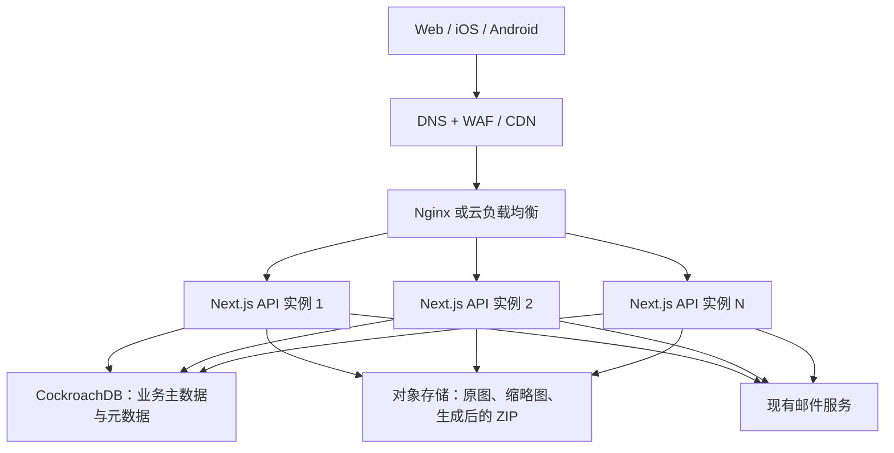
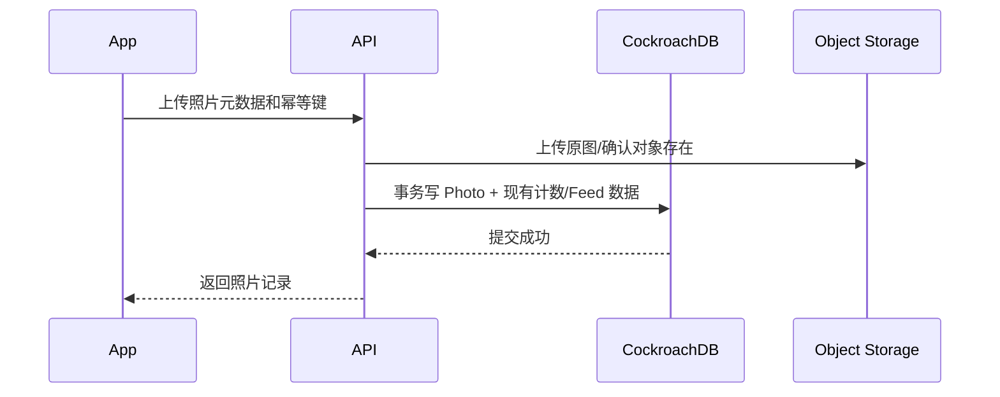

# Timeprint TeamSpace CockroachDB 水平扩展架构设计

| 项目 | 内容 |
| --- | --- |
| 文档状态 | 方案设计，可进入技术评审 |
| 适用系统 | `team_backend`、Web Dashboard、iOS/Android App |
| 当前数据库 | MySQL + Prisma ORM |
| 目标数据库 | CockroachDB + Prisma ORM |
| 更新日期 | 2026-08-13 |

## 1. 背景

Timeprint TeamSpace 的用户、团队、项目、成员关系、照片元数据和 Feed 数据会持续增长。一个用户可以加入或创建多个团队，因此用户不能固定归属到某个团队分片；照片、项目、成员权限等业务数据则天然具有团队边界。

本方案采用以下原则：

- 用户身份是全局数据，团队业务数据以 `groupID` 作为租户边界。
- `User` 和 `Team` 是多对多关系，通过 `TeamMember` 连接。
- CockroachDB 按主键和索引键空间自动切分 Key Range、复制并平衡到不同节点。
- 应用不维护“某个团队属于某台数据库”的静态路由表。
- 照片原图、缩略图和生成后的 ZIP 文件保留在对象存储，数据库只保存元数据和任务状态。
- 第一阶段保持现有 Next.js 单体职责，ZIP、邮件、统计和 Feed 逻辑不拆成独立服务。
- 数据库迁移与业务异步化解耦，Outbox、消息队列和独立 Worker 放到后续阶段。
- 第一阶段只增加必要的数据冗余和索引，不强制改变现有接口的同步一致性。

## 2. 建设目标

1. Next.js API 实例和 CockroachDB 节点可以分别水平扩展。
2. 单个用户加入多个团队时，能够高效读取“我的团队”和跨团队个人数据。
3. 普通团队的数据访问具有良好局部性，超大团队不会形成单点写入热点。
4. 任意单个应用实例或数据库节点故障时，服务能够继续运行。
5. MySQL 迁移期间尽量缩短只读窗口，并具备经过演练的回退路径。
6. 在数据量扩大后，照片流、Feed 和团队列表仍使用稳定的游标分页。

本阶段不包含以下目标：

- 不把照片二进制写入 CockroachDB。
- 不在第一阶段按团队建设多个独立数据库集群。
- 不立即建设跨洲多区域写入；初期以新加坡单区域、多可用区为主。
- 不引入 Outbox、消息队列或独立 Worker。
- 不拆分 ZIP 打包和邮件发送，继续由现有 Next.js 服务处理。
- 不强制把现有同步计数改为最终一致；热点优化根据上线后的监控结果实施。

## 3. 总体架构



### 3.1 服务职责

| 组件 | 主要职责 | 扩展方式 |
| --- | --- | --- |
| Nginx/负载均衡 | TLS、路由、健康检查、流量分发 | 双实例或托管负载均衡 |
| Next.js API | 登录、权限、CRUD、Feed、统计、邮件和 ZIP | 尽量无状态，横向增加实例 |
| CockroachDB | 强一致业务数据、关系和照片元数据 | 增加节点后自动再平衡 Range |
| 对象存储 + CDN | 原图、缩略图和下载包 | 由云服务水平扩展 |

第一阶段不新增独立业务服务。Next.js 实例可以横向扩展，但 ZIP 打包和邮件仍由收到请求的实例执行。长任务需要设置并发上限、超时和幂等保护，避免单个实例被耗尽。

## 4. 数据拆分维度

### 4.1 逻辑数据域

| 数据域 | 组织维度 | 说明 |
| --- | --- | --- |
| 用户、登录身份、设备、Session | 全局 `userID` | 用户可以加入多个团队 |
| 用户加入的团队 | `userID + groupID` | 支持“我的团队”反向查询 |
| 团队成员与权限 | `groupID + userID` | 支持成员列表和授权检查 |
| 项目、设置、邀请、Feed | `groupID` | 团队租户数据 |
| 团队照片 | `groupID + timestamp + photoID` | 团队相册访问路径 |
| 项目照片 | `groupID + projectID + timestamp + photoID` | 项目相册访问路径 |
| 成员照片 | `groupID + userID + timestamp + photoID` | 团队内成员相册 |
| 我的全部照片 | `userID + timestamp + photoID` | 跨团队辅助索引 |
| 按日统计 | `groupID + localDate + entity` | 按天列表和摘要 |

`groupID` 是业务租户键，不是用户分片键。用户登录后先按 `userID` 查询 `TeamMember`，获得当前页团队，再批量读取团队摘要。

### 4.2 物理拆分

CockroachDB 按每个表及二级索引的有序键空间切分 Range。Range 达到容量或负载阈值后自动拆分，并将副本平衡到不同节点。因此物理分布单位是 **Key Range**，不是完整团队，也不是完整用户。

```text
逻辑访问：groupID -> 团队内项目、成员、照片和 Feed
物理存储：table/index key -> Range -> 多节点副本
高频写入：groupID + shard/random ID -> 多个可并行写入的 Range
```

普通团队优先保持 `groupID` 前缀的数据局部性。若单个超大团队形成热点，则增加 `shard = hash(photoID) % N` 或 CockroachDB Hash-sharded Index，将该团队的并发写入分散到多个 Range。

### 4.3 API 团队上下文

并非每个接口都必须由客户端传递 `groupID`，但每个访问团队数据的 SQL 都必须具有经过服务端验证的团队上下文。接口分为三类：

| 接口类型 | `groupID` 来源 | 示例 |
| --- | --- | --- |
| 团队集合/创建 | 客户端显式传入 | 项目列表、照片列表、创建项目、团队设置 |
| 单资源操作 | 显式参数，或由资源 ID 反查 | 照片详情、删除项目、删除评论、ZIP 状态 |
| 全局操作 | 不需要 `groupID` | 登录、用户资料、我的团队、通过邀请码加入团队 |

服务端统一增加 `resolveTeamContext`，解析顺序如下：

1. 读取请求体、Query 或路径中的显式 `groupID`。
2. 若接口带 `photoID`、`projectID`、`feedID`、`commentID` 或任务 ID，则从资源主表反查真实 `groupID`。
3. 显式 `groupID` 与资源所属团队不一致时直接返回 404 或 403，并记录安全审计日志。
4. 使用解析出的 `groupID + userID` 查询 `TeamMember`，验证成员或管理员角色。
5. 把同一个 `groupID` 写入最终 Prisma `where` 条件，不能只做一次独立权限查询。

建议接口上下文类型：

```ts
type TeamContext = {
  groupID: string
  userID: string
  role: "OWNER" | "ADMIN" | "MEMBER"
  source: "explicit" | "resource" | "legacy-selection"
}
```

最终写操作必须绑定资源和团队：

```ts
// 推荐：复合唯一键
await prisma.project.update({
  where: { groupID_projectID: { groupID, projectID } },
  data,
})

// 过渡方案：检查实际更新数量
const result = await prisma.project.updateMany({
  where: { groupID, projectID, deletedAt: null },
  data,
})
if (result.count !== 1) return resourceNotFound()
```

不能先验证“用户是团队 A 管理员”，随后只用 `projectID` 更新项目；否则客户端可组合团队 A 的 `groupID` 和团队 B 的 `projectID` 形成越权操作。

#### 旧客户端兼容

迁移期间采用兼容但可观测的策略：

- 继续接受现有 POST Body 中的 `groupID`，GET 接口使用 Query 或路径参数。
- 资源 ID 能唯一反查团队时，旧客户端可暂不传 `groupID`。
- 同时收到多个位置的团队 ID 且值不一致时拒绝请求，避免参数覆盖。
- 只有无法反查资源的旧版列表接口，才临时回退到 `User.selectedGroupID`。
- `selectedGroupID` 只作为旧版读取兼容，不用于创建、修改、移动或删除操作。
- 使用 `selectedGroupID` 的请求记录客户端版本和接口名，待旧版本占比降至目标值后移除回退。

`User.selectedGroupID` 是用户级共享状态，同一账号在多设备切换团队时会互相覆盖，因此不能成为长期团队路由机制。新接口建议采用 `/api/groups/{groupID}/...`，现有接口则继续接受 Body/Query 的 `groupID`，避免一次性破坏 App 兼容性。

## 5. 核心数据模型

### 5.1 全局用户与多团队关系

```text
User (global)
  id
  email / appleUserID / googleUserID / zaloUserID
  profile and device fields

Team
  groupID
  ownerID -> User.id

TeamMember
  groupID -> Team.groupID
  userID  -> User.id
  role
  joinedAt
  UNIQUE(groupID, userID)
  INDEX(userID, joinedAt DESC, groupID)
  INDEX(groupID, role, userID)
```

关键访问方式：

- “我的团队”：走 `(userID, joinedAt, groupID)`，使用游标读取 30 个成员关系。
- “团队成员”：走 `(groupID, role, userID)`。
- 权限校验：使用 `(groupID, userID)` 唯一索引。
- 一个用户属于多少团队不会决定数据落在哪个单一节点，也不要求复制完整用户记录。

### 5.2 照片模型和索引

保留随机 `photoID` 作为全局主键，照片记录同时保存 `groupID`、`projectID`、`userID` 和拍摄时间。建议索引：

```sql
CREATE INDEX photo_by_team_time
ON "Photo" ("groupID", "timestamp" DESC, "photoID" DESC);

CREATE INDEX photo_by_project_time
ON "Photo" ("groupID", "projectID", "timestamp" DESC, "photoID" DESC);

CREATE INDEX photo_by_member_time
ON "Photo" ("groupID", "userID", "timestamp" DESC, "photoID" DESC);

CREATE INDEX photo_by_user_time
ON "Photo" ("userID", "timestamp" DESC, "photoID" DESC);
```

实际 SQL 需要按 CockroachDB 标识符、软删除条件和 Prisma 生成结果审查。只为真实接口保留索引，避免二级索引造成不必要的存储与写放大。

### 5.3 项目 ID

当前 `Project.projectID` 是 MySQL `Int @default(autoincrement())`。CockroachDB 的整型和自增语义与 MySQL 不同，直接切换会带来 Prisma `BigInt`、JSON 序列化和客户端兼容问题。

建议采用兼容迁移：

1. 新增随机 `projectUUID` 并建立唯一索引。
2. 保留 `projectID` 作为旧 App 使用的兼容编号。
3. 服务端双读、双返回，新写关联优先保存 `projectUUID`。
4. iOS、Android 和 Web 全部升级后，将关联外键切换到 `projectUUID`。
5. 最终让 `projectUUID` 成为主业务标识，旧编号只用于兼容查询。

## 6. 数据冗余设计

### 6.1 可采用的冗余字段

| 表/查询模型 | 冗余内容 | 一致性要求 |
| --- | --- | --- |
| `TeamSummary` | 团队名、成员数、项目数、照片数、最新照片时间 | 第一期同步维护，后续可最终一致 |
| `TeamMember` | 用户名、头像、成员照片数、最新照片 | 第一期沿用现有同步维护 |
| `Project` | 团队名、照片数、最新照片 | 第一期沿用现有同步维护 |
| `Photo` | 拍摄时作者名、项目名、团队名、时区、本地日期 | 历史快照 |
| `DailyPhotoStat` | 团队/项目/成员每天照片数 | 后续阶段，可重建 |
| `FeedItem` | 聚合时间、作者摘要、照片数、缩略图 | 第一期沿用现有逻辑 |
| `AdminOverviewStat` | 全局用户、团队、项目、照片摘要 | 后续阶段 |

账号身份、成员角色、照片所有权和删除状态不能仅依赖冗余字段，必须以规范化主表为准。

### 6.2 第一阶段写入流程



第一阶段保留当前同步写入方式，不引入 Outbox。CockroachDB 事务发生 `40001` 重试时，只重试数据库操作；对象上传、邮件和 ZIP 等外部操作不能放入可自动重试的事务回调。上传接口必须以客户端照片 ID 或幂等键阻止重复照片。

### 6.3 热点计数器

第一阶段继续同步更新 `Project.photoCount` 和 `TeamMember.photoCount`，同时监控事务冲突和热点。只有确认同一项目或成员行成为瓶颈时，后续阶段才改成按桶写入：

```text
CounterBucket
  groupID
  entityType: TEAM | PROJECT | MEMBER
  entityID
  bucket: 0..31
  count
  updatedAt
  UNIQUE(groupID, entityType, entityID, bucket)
```

桶号由 `hash(photoID) % 32` 决定。该模型不属于第一阶段迁移范围；未来可以由定时任务或独立 Worker 汇总，并从 `Photo` 主表执行对账修复。

## 7. 查询和分页规范

大表接口统一使用 Keyset/Cursor Pagination，不使用深度 `OFFSET`：

```json
{
  "items": [],
  "nextCursor": {
    "timestamp": "1786608000000",
    "photoID": "cm..."
  },
  "hasMore": true
}
```

规则如下：

- 照片排序使用 `(timestamp DESC, photoID DESC)`，防止相同时间出现重复或遗漏。
- 团队列表使用 `(joinedAt DESC, groupID DESC)`。
- Feed 使用 `(eventAt DESC, feedID DESC)`，聚合时间采用真实拍摄事件时间，不能采用重试上传时间。
- `totalCount` 不与每一页同步扫描大表；需要时读取摘要或独立统计接口。
- 先分页读取主键，再按本页 ID 批量获取摘要，禁止 N+1 查询。

## 8. CockroachDB 集群结构

### 8.1 初始生产拓扑

建议优先使用 CockroachDB Cloud Dedicated。若自建：

- 新加坡单区域，至少 3 个数据库节点，分布在 3 个独立故障域。
- 每个节点使用独立 VM、持久化 NVMe、稳定主机名和节点证书。
- 数据库不与 Next.js 应用共享磁盘或容器生命周期。
- 副本因子 RF=3；数据库节点不直接暴露到公网。
- 应用实例和数据库部署在同一区域和私有网络。
- 备份写入独立账号或独立区域的对象存储。

### 8.2 连接池

连接数按“实例数 × 每实例连接上限”控制：

```text
数据库连接预算 >= API实例数 × API连接上限
              + 运维和迁移保留连接
```

初始可从每个 API 实例 `connection_limit=10` 开始，通过活跃查询、排队时间和数据库 CPU 调整。扩容应用前必须校验总连接预算，不能让实例数无限放大连接数。

Prisma datasource 必须使用 `provider = "cockroachdb"`。生产连接启用 TLS 验证，迁移命令使用独立、受限的直连配置。生产变更使用经评审的 `prisma migrate deploy` 或 SQL migration，不使用 `prisma db push`。

### 8.3 事务重试

CockroachDB 默认 Serializable 隔离可能返回 `SQLSTATE 40001`。服务端需要统一事务包装器：

- 只重试可识别的序列化冲突。
- 最多重试 3 到 5 次，并使用指数退避和随机抖动。
- 所有写接口必须有幂等键或唯一约束。
- 自动重试只包裹数据库事务；邮件、对象存储和 ZIP 操作放在事务外，并增加幂等保护。
- 记录重试次数、冲突表和事务耗时，作为热点识别依据。

## 9. 水平扩展策略

### 9.1 API 层

- API 保持无状态，Session 存数据库，短期会话摘要可缓存到 Redis。
- Dokploy 运行多个相同版本实例，由 Nginx 或云负载均衡分发请求。
- 使用 readiness/liveness 健康检查和优雅停机，部署时先摘流量再结束进程。
- 上传接口采用对象存储直传或预签名 URL，避免大文件长时间占用 API 实例。
- 现有 ZIP 和邮件逻辑继续运行在 API 服务内，设置进程级并发上限和请求超时。

### 9.2 后续服务拆分（非第一阶段）

只有当 ZIP、邮件、统计或 Feed 明显占用 API 资源时，再引入 Outbox、队列和 Worker。拆分顺序建议为 ZIP、邮件、统计/Feed；每一步单独评估和上线，不作为 CockroachDB 迁移的前置条件。

### 9.3 数据库层

- 初期 3 节点，容量或负载达到阈值后增加节点。
- CockroachDB 自动复制和再平衡 Range，应用连接地址不随数据位置改变。
- 随机 UUID/CUID 避免递增主键尾部热点。
- 单个超大团队出现热点后，再为对应高写表增加 hash shard；不提前给所有表增加复杂分桶。
- 若未来用户跨洲增长，再评估 Regional by Row；需要同时把 API 部署到相应区域，否则多区域数据库不会自动消除应用网络延迟。

## 10. 缓存策略

| 缓存项 | 建议 TTL | 失效方式 |
| --- | --- | --- |
| 团队摘要 | 5–15 分钟 | 写操作主动删除 + TTL |
| 成员数量 | 2 小时 | 成员变更事件主动删除 |
| 团队权限 | 1–5 分钟 | 角色/退出/删除时主动删除 |
| 语言及静态配置 | 12–24 小时 | 版本化 Key |
| 照片列表 | 通常不缓存或 30–60 秒 | 上传/删除后短 TTL 自愈 |

缓存 Key 必须包含 `groupID` 和必要的 `userID`，避免跨团队或跨用户数据泄露。权限变更不能只等待长 TTL 到期。

## 11. 高可用、备份和容灾

- 数据库节点跨故障域部署，应用至少两个实例。
- 每日全量备份，并按业务恢复点目标增加增量备份频率。
- 备份保留策略建议 7 个每日、4 个每周和 3 个每月版本，最终以合规要求为准。
- 每季度执行恢复演练，验证数据库、对象存储元数据和照片对象的一致性。
- 对象存储启用版本控制或删除保护，应用删除先软删除，再由延迟清理任务物理删除。
- 明确 RPO/RTO 后再决定是否建设第二地区灾备集群；不能把“有三副本”等同于“有可用备份”。

## 12. 可观测性与扩容阈值

必须监控：

- API 吞吐、P50/P95/P99、5xx、事件循环延迟和实例内存。
- Prisma 活跃连接、连接等待、查询耗时和慢 SQL。
- CockroachDB CPU、内存、磁盘延迟、容量、Range 分布和热点。
- `40001` 重试率、事务重试后失败率。
- 对象存储上传失败率、CDN 命中率和 ZIP 生成耗时。
- 数据库主表与摘要/计数器之间的对账差异。

建议扩容触发线：

- 数据库 CPU 持续超过 60%–70%，或 SQL P95 持续恶化。
- 单节点磁盘容量超过 60%–70%，同时增长趋势无法在维护窗口内消化。
- Range 热点长期集中在少数节点或事务重试率明显上升。
- API 实例 CPU/延迟连续超过目标，并已排除数据库瓶颈。
- ZIP 并发导致 API 内存、CPU 或请求耗时超过业务 SLA。

阈值需要通过压测和生产基线校准，不能只依据注册用户数量。

## 13. 安全与租户隔离

- 所有团队资源接口都必须同时校验 `userID + groupID` 成员关系。
- 普通成员、管理员和创建者权限在服务端执行，不能依赖前端隐藏按钮。
- 查询照片、项目、Feed 时必须显式携带 `groupID` 条件。
- 数据库账号按 API、Migration 和只读审计分权。
- 数据库只允许私网连接，启用 TLS、证书轮换和密钥托管。
- SQL 日志不得记录验证码、Token、浏览器密钥或其他敏感参数。
- 对批量下载、登录、邀请码和照片上传实施用户及 IP 双维度限流。

## 14. 迁移实施步骤

### 阶段 0：基线和容量评估

1. 采集各表行数、总容量、每日增长量、QPS、P95/P99 和慢查询。
2. 统计最大团队照片数、单团队峰值上传 QPS、用户平均/最大团队数。
3. 确认 MySQL 版本、GTID、binlog 保留期和字符集。
4. 制定 SLO、RPO、RTO 和迁移维护窗口。

### 阶段 1：API 租户边界与查询改造

1. 为项目新增 `projectUUID`，完成回填和双读兼容。
2. 实现统一团队上下文解析，修复只按 `projectID` 等资源 ID 写入的越权风险。
3. 保证团队资源 SQL 同时包含可信 `groupID` 和资源 ID。
4. 将照片、Feed、团队列表逐步改为游标分页。
5. 增加上传幂等键、必要唯一约束以及数据对账脚本。
6. ZIP、邮件、Feed 和现有计数更新方式保持不变。

### 阶段 2：CockroachDB 兼容改造

1. 建立独立测试集群和独立 Prisma schema/migration baseline。
2. 将 datasource provider 改为 `cockroachdb`，审查 `Int`、`BigInt`、`Decimal`、JSON、Text 和时间字段。
3. 使用显式 SQL 建立必要索引；只有压测发现热点时才增加 hash-sharded index。
4. 实现统一事务重试器并覆盖所有多表写事务。
5. 执行 API 契约测试，确保旧 App 请求和返回格式不变。

### 阶段 3：数据迁移和影子验证

1. 使用 MOLT Fetch 或经过验证的 ETL 批量导入历史数据。
2. 使用 MySQL GTID 和 MOLT Replicator 同步后续增量。
3. 比较表行数、主键、外键、抽样校验和、统计摘要及软删除数据。
4. 对只读接口执行影子查询，比较团队列表、权限、照片顺序和 Feed 结果。
5. 进行并发上传、同项目高并发、节点故障和 Range 再平衡压测。

### 阶段 4：生产切换

1. 进入短时只读模式，暂停照片上传、团队修改及其他写请求。
2. 等待增量同步延迟归零，完成最终校验。
3. 切换应用连接并部署 CockroachDB 版本 Prisma Client。
4. 冒烟验证登录、扫码登录、团队权限、上传、Feed、邀请、删除和 ZIP 下载。
5. 恢复写入并持续观察错误率、P95、事务重试、ZIP 和邮件执行情况。
6. MySQL 保持只读 7–14 天，不立即删除。

### 阶段 5：稳定化

1. 根据真实查询删除无效索引、补充必要索引。
2. 对热点团队启用分桶或 hash-sharded index。
3. 校准连接池、缓存 TTL、API 并发和数据库节点规格。
4. 完成恢复演练后再结束旧数据库保留期。

### 阶段 6：可选异步化演进

该阶段不与 CockroachDB 迁移同时实施，需由生产指标触发：

1. 若 ZIP 打包持续占用 API CPU、内存或请求时长，先拆分 ZIP 任务。
2. 若邮件重试影响接口响应，再拆分邮件任务。
3. 若同步计数产生明显 `40001` 冲突，再引入计数桶和异步汇总。
4. 若 Feed 聚合影响上传延迟，再引入 Outbox 和 Feed Worker。
5. 每次只拆一个职责，保留兼容接口并独立验证回退。

## 15. 回退方案

切换前必须演练以下流程：

- 切换前：停止写入、等待 MySQL 到 CockroachDB 同步归零，可直接恢复 MySQL 写入。
- 切换后：若 CockroachDB 已产生新写入，不能直接把流量切回旧 MySQL，否则会丢失数据。
- 需要回退写能力时，应在切换前部署并验证 CockroachDB 到 MySQL 的反向同步，或重新进入维护模式导出增量。
- 回退判定包括持续 5xx、关键接口数据不一致、不可接受的事务冲突或延迟。
- 所有回退步骤、负责人和预计耗时必须形成值班 Runbook。

## 16. 测试与验收

| 测试项 | 验收标准 |
| --- | --- |
| 多团队用户 | 一个用户加入大量团队后，分页、权限和切换团队结果正确 |
| 照片并发上传 | 不重复、不丢失；现有同步统计与主表一致 |
| 游标分页 | 翻页期间有新增数据时无重复、无异常遗漏 |
| 事务冲突 | `40001` 数据库事务自动重试，ZIP、邮件等外部操作不重复 |
| 单节点故障 | 集群和核心 API 保持可用 |
| 数据迁移 | 关键表数量、抽样内容、关联和软删除状态一致 |
| 缓存隔离 | 不出现跨团队数据或权限泄露 |
| 恢复演练 | 在约定 RTO/RPO 内恢复数据库并访问照片对象 |
| 旧客户端 | 现有 iOS/Android 登录和项目 ID 接口兼容 |

## 17. 当前代码改造重点

- [`prisma/schema.prisma`](../prisma/schema.prisma)：数据库 provider、项目 UUID、复合约束和查询索引。
- [`lib/prisma.ts`](../lib/prisma.ts)：连接池、查询日志脱敏、事务重试封装。
- [`app/api/_utils/api.ts`](../app/api/_utils/api.ts)：增加统一团队上下文解析和权限校验。
- [`app/api/photo/upload/route.ts`](../app/api/photo/upload/route.ts)：保留同步计数，增加幂等写入和事务重试保护。
- [`app/api/photo/list/v1/route.ts`](../app/api/photo/list/v1/route.ts)：改为稳定游标分页。
- [`app/api/group/home/route.ts`](../app/api/group/home/route.ts)：使用团队范围索引和数据库分页。
- [`app/api/admin/overview/route.ts`](../app/api/admin/overview/route.ts)：保留分页和现有缓存，避免全表读取。
- [`app/api/feed/list/route.ts`](../app/api/feed/list/route.ts)：在数据库按游标分页，避免应用内全量排序。

## 18. 关键技术决策

1. 不按用户固定分库，因为用户与团队是多对多关系。
2. 不在应用层按 `groupID` 手工维护数据库路由，优先使用 CockroachDB Range 自动分布。
3. 全局用户以 `userID` 访问，团队业务以 `groupID` 访问，跨团队场景使用独立二级索引。
4. 随机 ID 负责分散写入；超大团队按监控结果增加 shard，而不是默认过度分片。
5. 第一阶段保留现有同步流程，只使用必要冗余；异步查询模型后续按监控结果引入。
6. 原图属于对象存储，数据库只保存元数据、权限和处理状态。
7. 第一阶段选择新加坡单区域多可用区，待业务真正全球化后再评估多区域表。
8. ZIP、邮件、Outbox 和 Worker 不属于第一阶段，不阻塞数据库迁移。

## 19. 官方参考资料

- [Prisma CockroachDB connector](https://www.prisma.io/docs/orm/v6/overview/databases/cockroachdb)
- [CockroachDB performance best practices](https://www.cockroachlabs.com/docs/v26.2/performance-best-practices-overview)
- [Understand and avoid hotspots](https://www.cockroachlabs.com/docs/stable/understand-hotspots)
- [Hash-sharded indexes](https://www.cockroachlabs.com/docs/stable/hash-sharded-indexes)
- [Pagination best practices](https://www.cockroachlabs.com/docs/v26.2/pagination)
- [Transaction retry errors](https://www.cockroachlabs.com/docs/stable/transaction-retry-error-reference)
- [Connection pooling](https://www.cockroachlabs.com/docs/stable/connection-pooling)
- [Multi-region overview](https://www.cockroachlabs.com/docs/stable/multiregion-overview)
- [MOLT migration considerations](https://www.cockroachlabs.com/docs/molt/migration-considerations)
- [MOLT Replicator](https://www.cockroachlabs.com/docs/stable/molt/molt-replicator)
